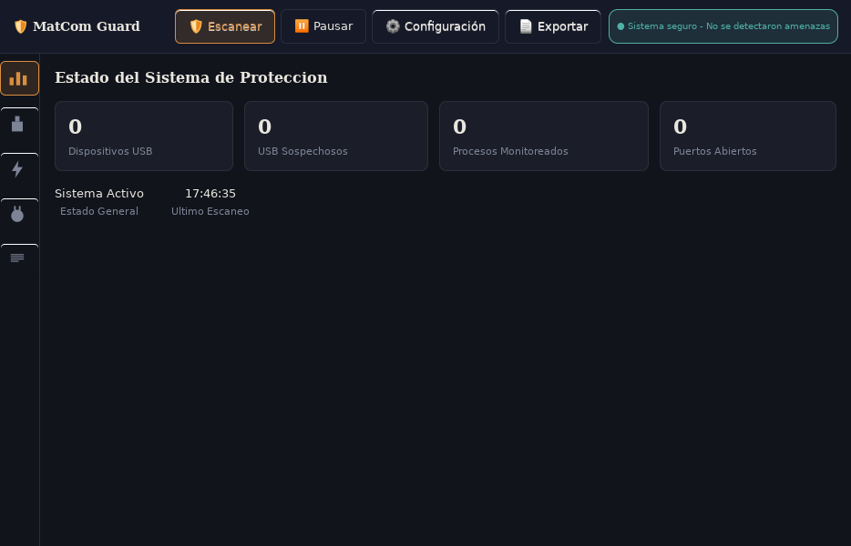
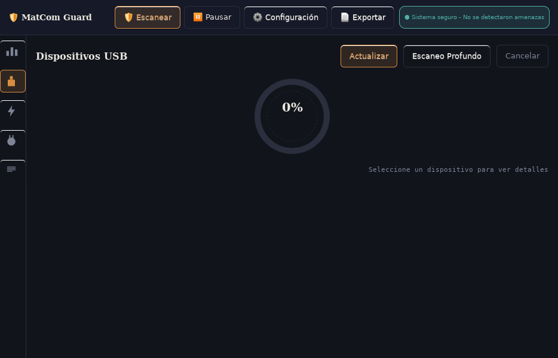
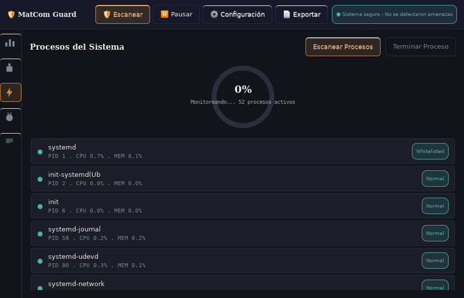
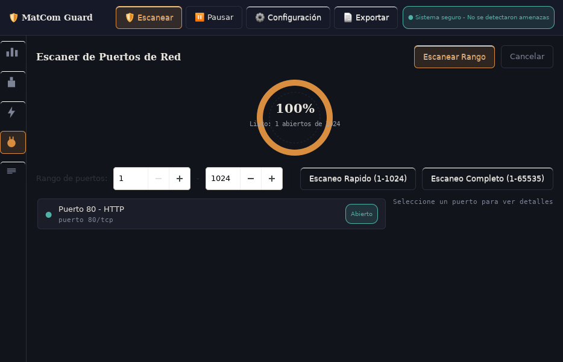
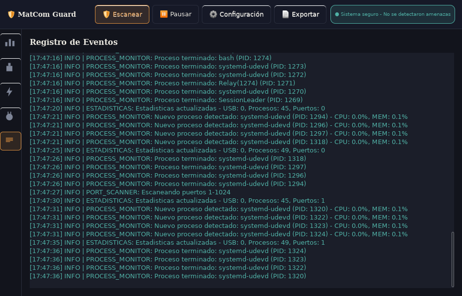

# 🛡️ MatCom Guard - Sistema de Monitoreo y Seguridad

🇬🇧 [Read in English](README.md) · 🇪🇸 Español (estás aquí)

[]()
[]()
[]()
[]()
[]()
[]()

> *En este vasto reino digital, los virus y amenazas informáticas son como plagas y ejércitos invasores que buscan corromper tus tierras y saquear tus recursos. MatCom Guard es tu muralla y tu guardia real, un sistema de monitoreo y seguridad en tiempo real diseñado para vigilar y proteger tu reino (sistema UNIX/Linux) de cualquier intruso o actividad sospechosa.*

## 🌟 Características Destacadas

- **🔒 Monitoreo Integral en Tiempo Real**: USB, procesos y puertos de red
- **🎯 Funcionalidad USB Diferenciada**: Sistema único de snapshots y detección avanzada
- **⚡ Interfaz Gráfica Moderna**: GUI basada en GTK+3 con dashboard centralizado
- **🧠 Análisis Inteligente**: Heurísticas avanzadas de detección de amenazas
- **📊 Exportación Profesional**: Reportes PDF con gráficos integrados
- **🔧 Configuración Flexible**: Umbrales personalizables y auto-escaneo
- **🛡️ Thread-Safe Architecture**: Robusto sistema multi-hilo

## 📋 Tabla de Contenidos

- [🌟 Características Destacadas](#-características-destacadas)
- [⚡ Vista Rápida](#-vista-rápida)
- [📸 Capturas de Pantalla](#-capturas-de-pantalla)
- [🏗️ Arquitectura del Sistema](#️-arquitectura-del-sistema)
- [🛠️ Instalación y Compilación](#️-instalación-y-compilación)
- [📖 Guía de Uso](#-guía-de-uso)
- [🔧 Funcionalidades Avanzadas](#-funcionalidades-avanzadas)
- [📚 Documentación Técnica](#-documentación-técnica)
- [🔧 Resolución de Problemas](#-resolución-de-problemas)
- [🤝 Contribución](#-contribución)
- [📜 Licencia y Créditos](#-licencia-y-créditos)

## ⚡ Vista Rápida

```bash
# Compilación rápida
make clean && make

# Ejecución
./matcom-guard

# Verificar dependencias
make check-deps
```

**Funciones principales disponibles inmediatamente:**
- 🔍 **Monitor USB**: Detección automática de dispositivos y análisis forense
- ⚡ **Monitor Procesos**: Alertas de CPU/memoria en tiempo real
- 🔌 **Escáner Puertos**: Escaneo rápido (1-1024) y completo (1-65535)
- 📊 **Dashboard**: Vista consolidada del estado del sistema
- 📄 **Exportar PDF**: Reportes profesionales con un clic
- ⚙️ **Configuración**: un solo archivo compartido, editable desde el diálogo "Configuración" dentro de la app

## 📸 Capturas de Pantalla

| Dashboard | Monitor USB |
|:---:|:---:|
|  |  |

| Monitor de Procesos | Escáner de Puertos |
|:---:|:---:|
|  |  |

<details>
<summary>Vista de registros en vivo</summary>



</details>

## 🏗️ Arquitectura del Sistema

MatCom Guard está construido con una arquitectura de 3 capas que mantiene el backend completamente independiente de la GUI:

```
┌─────────────────────────────────────────────────────────────┐
│                    CAPA PRESENTACIÓN                         │
│   Shell "Night Watch": riel de iconos + insignia + 5 paneles │
│  ┌───────────┬───────────┬───────────┬───────────┬────────┐ │
│  │ Dashboard │    USB    │ Procesos  │  Puertos  │ Logs   │ │
│  └───────────┴───────────┴───────────┴───────────┴────────┘ │
│           Diálogo de configuración (con pestañas, modal)     │
└─────────────────────────────────────────────────────────────┘
                               │
┌─────────────────────────────────────────────────────────────┐
│                 CAPA INTEGRACIÓN                             │
│  ┌─────────────────┬─────────────────┬─────────────────┐    │
│  │  GUI-Backend    │   Coordinador   │   Puente de      │    │
│  │   Adapters      │    Sistema      │   Hilos          │    │
│  └─────────────────┴─────────────────┴─────────────────┘    │
└─────────────────────────────────────────────────────────────┘
                               │
┌─────────────────────────────────────────────────────────────┐
│                   CAPA BACKEND                               │
│  ┌─────────────────┬─────────────────┬─────────────────┐    │
│  │   Monitor       │   Monitor       │   Escáner        │    │
│  │     USB         │   Procesos      │   Puertos        │    │
│  └─────────────────┴─────────────────┴─────────────────┘    │
└─────────────────────────────────────────────────────────────┘
```

Cada panel tiene su propio hilo de trabajo (o reutiliza el módulo compartido
`gui_periodic_worker`) y solo toca widgets de GTK a través de `g_idle_add`/
`gui_thread_bridge_post` -- el backend nunca llama a GTK directamente. La
navegación es un riel angosto de iconos a la izquierda (Dashboard/USB/
Procesos/Puertos/Logs); ya no existe el notebook con pestañas.

### 🧩 Componentes Clave

#### **📊 Dashboard Centralizado**
- **Vista unificada** de todos los módulos del sistema
- **Estadísticas en tiempo real** de dispositivos, procesos y puertos
- **Estado global del sistema** con una insignia de estado con colores
- **Acceso rápido** a todas las funcionalidades principales

#### **💾 Sistema USB Avanzado**
```c
typedef struct {
    char *device_name;          // Identificador único del dispositivo
    FileInfo **files;           // Array dinámico de archivos analizados
    int file_count;             // Contador de archivos en el snapshot
    int capacity;                 // Capacidad del array (crece incrementalmente)
    time_t snapshot_time;       // Timestamp de creación del snapshot
} DeviceSnapshot;
// Cada FileInfo tiene su propio sha256_hash[65] para verificar integridad.
```

**Funcionalidad Diferenciada:**
- **🔄 Botón "Actualizar"**: ÚNICO capaz de retomar snapshots de referencia
- **🔍 Botón "Escaneo Profundo"**: Análisis comparativo SIN alterar línea base
- **🚨 Sistema de Alertas**: Heurísticas avanzadas de detección de amenazas

#### **⚡ Monitor de Procesos Inteligente**
```c
typedef struct {
    pid_t pid;                  // Identificador del proceso
    char name[256];             // Nombre del ejecutable
    float cpu_usage;            // Porcentaje de CPU utilizado
    float mem_usage;            // Porcentaje de memoria utilizada
    time_t inicio_alerta;       // Timestamp en que empezó la alerta activa
    int alerta_activa;          // 1 si hay una alerta activa actualmente
    int is_whitelisted;         // Estado de lista blanca
} ProcessInfo;
```

#### **🔌 Escáner de Puertos Profesional**
```c
typedef struct {
    int port;                   // Número del puerto
    char service_name[64];      // Nombre del servicio identificado
    int is_open;                // Estado del puerto (abierto/cerrado)
    int is_suspicious;          // Evaluación de riesgo de seguridad
} PortInfo;
```

## 🛠️ Instalación y Compilación

### **📋 Requisitos del Sistema**

#### **Sistema Operativo**
- Linux (Ubuntu 18.04+, Debian 10+, CentOS 7+, Arch Linux)
- Kernel 3.2+ con soporte para `/proc` y `/sys`
- Acceso a dispositivos USB y permisos de red

#### **Dependencias Esenciales**
```bash
# Ubuntu/Debian
sudo apt-get update
sudo apt-get install build-essential pkg-config git
sudo apt-get install libgtk-3-dev libcairo2-dev cairo-pdf-dev
sudo apt-get install libssl-dev libudev-dev
sudo apt-get install pthread libc6-dev

# CentOS/RHEL/Fedora
sudo dnf groupinstall "Development Tools"
sudo dnf install gtk3-devel cairo-devel cairo-pdf-devel
sudo dnf install openssl-devel libudev-devel
sudo dnf install pkg-config git

# Arch Linux
sudo pacman -S base-devel gtk3 cairo openssl libudev pkg-config git
```

#### **Bibliotecas Utilizadas**
| Biblioteca | Versión | Propósito |
|------------|---------|-----------|
| **GTK+ 3.0** | ≥3.20 | Interfaz gráfica moderna y responsiva |
| **Cairo/Cairo-PDF** | ≥1.14 | Renderizado gráfico y exportación PDF |
| **OpenSSL** | ≥1.1 | Criptografía para hashes SHA-256 |
| **libudev** | ≥230 | Monitoreo de dispositivos USB en Linux |
| **pthreads** | POSIX | Multi-threading para monitoreo en tiempo real |

### **🔧 Proceso de Compilación**

#### **Instalación Estándar**
```bash
# 1. Clonar el repositorio
git clone https://github.com/jccarmenate/MatCom-Guard-SO-Project.git
cd MatCom-Guard-SO-Project

# 2. Verificar dependencias
make check-deps

# 3. Compilar el proyecto
make clean && make

# 4. Ejecutar la aplicación
./matcom-guard

# 5. Instalación en el sistema (opcional)
sudo make install
```

#### **Compilación con Opciones de Debug**
```bash
# Para desarrollo y debugging
make debug

# Para análisis de memoria
make clean
CFLAGS="-g -DDEBUG -O0 -fsanitize=address" make

# Ejecutar con Valgrind
valgrind --leak-check=full --show-leak-kinds=all ./matcom-guard
```

### **⚙️ Makefile Inteligente**
El proyecto incluye un Makefile completo con múltiples opciones de compilación:

```makefile
# Configuración optimizada para desarrollo y producción
CC = gcc
CFLAGS = -Wall -Wextra -std=c99 -g -Iinclude -DDEBUG
GTK_FLAGS = `pkg-config --cflags --libs gtk+-3.0`
CAIRO_FLAGS = `pkg-config --cflags --libs cairo cairo-pdf`
LIBS = -lcrypto -lpthread -ludev

# Comandos disponibles:
make                    # Compilación estándar
make clean              # Limpiar archivos objeto
make debug             # Compilación con símbolos de debug
make install           # Instalar en el sistema
make test              # Ejecutar programa
make check-deps        # Verificar dependencias
```

**Características del Makefile:**
- **Detección automática de dependencias** con `check-deps`
- **Soporte para compilación condicional** con banderas debug
- **Limpieza automática** de archivos temporales
- **Instalación del sistema** con privilegios elevados

### **🔐 Configuración de Permisos**

#### **Permisos para Dispositivos USB**
```bash
# Agregar usuario al grupo plugdev para acceso USB
sudo usermod -a -G plugdev $USER

# Crear regla udev personalizada (opcional)
echo 'SUBSYSTEM=="usb", GROUP="plugdev", MODE="0664"' | \
sudo tee /etc/udev/rules.d/99-matcom-guard-usb.rules

# Recargar reglas udev
sudo udevadm control --reload-rules
sudo udevadm trigger
```

#### **Permisos para Monitoreo de Procesos**
```bash
# Para monitoreo completo de procesos del sistema
sudo chmod +s ./matcom-guard

# O ejecutar con privilegios elevados
sudo ./matcom-guard
```

### **📁 Estructura del Proyecto**
```
MatCom-Guard-SO-Project/
├── Makefile                       # Sistema de compilación
├── README.md / README.es.md       # Esta documentación
├── include/                       # Headers del proyecto
│   ├── device_monitor.h           # Monitor de dispositivos USB
│   ├── process_monitor.h          # Monitor de procesos
│   ├── port_scanner.h             # Escáner de puertos
│   ├── threadpool.h, progress.h   # Primitivas compartidas backend/GUI
│   └── gui*.h                     # GUI: shell, paneles, adaptadores, widgets
├── src/                           # Código fuente principal
│   ├── main.c                     # Punto de entrada del programa
│   ├── device_monitor.c           # Implementación del monitor USB
│   ├── process_monitor.c          # Implementación del monitor de procesos
│   ├── port_scanner.c             # Implementación del escáner de puertos
│   └── gui/                       # Código de la interfaz gráfica
│       ├── gui_main.c             # Ventana, ciclo de vida del backend, barra de acciones
│       ├── gui_shell.c            # Shell Night Watch: riel de iconos + insignia
│       ├── gui_backend_adapters.c # Conversión de structs backend -> GUI
│       ├── gui_system_coordinator.c # Estado entre módulos, puntaje de seguridad
│       ├── gui_config_dialog.c    # Diálogo de configuración (con pestañas)
│       ├── gui_thread_bridge.c    # Entrega de progreso segura entre hilos
│       ├── gui_periodic_worker.c  # Bucle de fondo interrumpible, compartido
│       ├── panels/                # Los 5 paneles reales (dashboard/usb/procesos/puertos/logs)
│       ├── widgets/                # guard_dial (medidor Cairo), gui_icons (iconos Cairo)
│       └── window/                # gui_status.c (estado del sistema -> insignia del shell)
├── tests/unit/                    # Tests unitarios con assert (ver `make test-unit`)
└── docs/                          # Specs de diseño, planes, capturas de pantalla
```

## 📖 Guía de Uso

### **🚀 Inicio Rápido**

1. **Lanzar la Aplicación**
   ```bash
   ./matcom-guard
   ```

2. **Dashboard Principal**
   - Vista general del estado del sistema
   - Estadísticas en tiempo real
   - Acceso rápido a todos los módulos

3. **Escaneo Básico**
   - **Puertos**: Botones "Escaneo Rápido" y "Escaneo Completo"
   - **Procesos**: Monitoreo automático con alertas
   - **USB**: Funcionalidad diferenciada única

### **🔌 Monitoreo de Dispositivos USB**

#### **Funcionalidad Diferenciada Única**

**🔄 Botón "Actualizar"**
- **Función Exclusiva**: Único capaz de retomar snapshots
- **Uso**: Después de cambios legítimos en dispositivos
- **Resultado**: Establece nueva línea base de referencia
- **Estado GUI**: Marca dispositivos como "ACTUALIZADO"

**🔍 Botón "Escaneo Profundo"**
- **Función No Destructiva**: Compara sin alterar snapshots
- **Uso**: Verificación de seguridad periódica
- **Resultado**: Detecta cambios sin modificar línea base
- **Estados GUI**: "LIMPIO", "CAMBIOS", "SOSPECHOSO"

#### **Criterios de Detección de Amenazas**
```
Actividad Sospechosa:
├── Eliminación Masiva: >10% archivos eliminados
├── Modificación Masiva: >20% archivos modificados
├── Actividad Alta: >30% cambios totales
└── Inyección: Muchos archivos nuevos en dispositivos pequeños
```

### **📊 Monitoreo de Procesos**

- **Tiempo Real**: Actualización continua de CPU y memoria
- **Alertas Inteligentes**: Detección de procesos sospechosos
- **Información Detallada**: PID, nombre, usuario, estado
- **Acciones**: Terminación segura de procesos problemáticos

### **🔍 Escaneo de Puertos**

- **Escaneo Rápido**: Puertos comunes (21, 22, 23, 25, 53, 80, 110, 443, 993, 995)
- **Escaneo Completo**: Rango amplio de puertos (1-65535)
- **Detección de Servicios**: Identificación automática de servicios
- **Análisis de Amenazas**: Evaluación de riesgos de seguridad

## 🔧 Funcionalidades Avanzadas

### **📄 Exportación de Reportes PDF**

```c
// Sistema profesional de reportes
- Formato profesional con logos
- Información detallada de todos los módulos
- Timestamps y metadatos completos
```

### **🔄 Sistema de Logging Avanzado**

```c
// Categorías de logging
- INFO: Información general
- WARNING: Advertencias importantes
- ERROR: Errores del sistema
- ALERT: Amenazas detectadas
```

### **⚙️ Configuración Flexible**

Un único archivo de configuración, `~/.config/matcom-guard/matcomguard.conf`,
se lee una vez al iniciar y lo comparten el backend y el diálogo
"Configuración" de la GUI (barra de acciones superior) -- ambos leen y
escriben exactamente el mismo struct en memoria, asi que no hay riesgo de
que un umbral quede desincronizado entre los dos:

```properties
# Archivo: ~/.config/matcom-guard/matcomguard.conf
UMBRAL_CPU=70.0                    # Umbral de CPU -- controla el bucle de alertas
                                    # real del backend Y el coloreado del panel de Procesos
UMBRAL_RAM=50.0                    # Lo mismo, para memoria
INTERVALO=5                        # Intervalo propio del backend para su bucle de monitoreo (segundos)
DURACION_ALERTA=10                 # Duración de alertas (segundos)
INTERVALO_ESCANEO_USB=30           # Debajo: editables desde las otras pestañas
INTERVALO_ESCANEO_PROCESOS=5       # del diálogo, se guardan, pero ningún escaneo
INTERVALO_ESCANEO_PUERTOS=300      # las lee todavía -- ver las pestañas del diálogo
AUTO_ESCANEO_USB=1
AUTO_ESCANEO_PROCESOS=1
AUTO_ESCANEO_PUERTOS=0
ALERTAS_SONORAS=1
NOTIFICACIONES=1
GUARDAR_LOGS=1
RANGO_PUERTOS_INICIO=1
RANGO_PUERTOS_FIN=1024
WHITELIST=systemd,kthreadd,ksoftirqd,migration,rcu_gp,rcu_par_gp,watchdog,stress
```

Solo `UMBRAL_CPU`/`UMBRAL_RAM`/`WHITELIST` afectan hoy el comportamiento real
de los escaneos de punta a punta. El resto de los ajustes del diálogo
(intervalos de escaneo, auto-escaneo, sonido/notificaciones, rango de
puertos) se guardan y son editables, pero aún no están conectados al
comportamiento de los escaneos.

### **🛡️ Seguridad Thread-Safe**

```c
// Protección robusta contra race conditions
pthread_mutex_t state_mutex = PTHREAD_MUTEX_INITIALIZER;
volatile int should_stop_monitoring = 0;

// Timeout inteligente para evitar bloqueos
int timeout_seconds = 3;
// Verificación periódica cada segundo
```

## 📚 Documentación Técnica

### **🔍 APIs Principales**

Cada panel es dueño de su módulo de punta a punta: construye sus propios
widgets de GTK, conecta los callbacks del backend, y expone una pequeña API
de ciclo de vida a `gui_main.c`.

#### **Panel USB** (`gui_usb_panel.h`)
```c
GtkWidget *gui_usb_panel_create(void);     // Construye el panel, inicia auto-monitoreo
void gui_usb_panel_shutdown(void);         // Detiene el monitoreo, libera el cache de snapshots
```
Respaldado por `create_device_snapshot_ex()` de `device_monitor.h`
(cancelable, paralelizado con pool de hashing) y `free_device_snapshot()`.

#### **Panel de Procesos** (`gui_process_panel.h`)
```c
GtkWidget *gui_process_panel_create(void);
void gui_process_panel_shutdown(void);
int get_process_statistics_for_gui(int *total_processes, int *high_cpu_count,
                                   int *high_memory_count, int *suspicious_count);
```
Respaldado por `start_monitoring()`/`stop_monitoring()` y
`get_process_list_copy()` de `process_monitor.h`.

#### **Panel de Puertos** (`gui_ports_panel.h`)
```c
GtkWidget *gui_ports_panel_create(void);
void gui_ports_panel_shutdown(void);
```
Respaldado por el escáner real multi-hilo y cancelable de `port_scanner.h`:
```c
int scan_ports_range(int start_port, int end_port, int num_threads,
                      ProgressCallback cb, void *user_data,
                      volatile sig_atomic_t *cancel, ScanResult *out);
```

### **🧪 Casos de Prueba**

#### **Pruebas de Funcionalidad USB**
```bash
# Prueba 1: Funcionalidad diferenciada
1. Conectar dispositivo USB
2. Presionar "Actualizar" → Verificar estado "ACTUALIZADO"
3. Modificar archivos en dispositivo
4. Presionar "Escaneo Profundo" → Verificar detección de cambios
5. Verificar que snapshot no cambió

# Prueba 2: Detección de amenazas
1. Eliminar >10% de archivos → Verificar estado "SOSPECHOSO"
2. Modificar >20% de archivos → Verificar alerta de seguridad
```

#### **Pruebas de Robustez**
```bash
# Prueba de cierre limpio
1. Ejecutar monitoreo completo
2. Cerrar aplicación → Verificar terminación en <5 segundos
3. Verificar que no quedan procesos zombie

# Prueba de concurrencia
1. Ejecutar múltiples escaneos simultáneos
2. Verificar protección contra race conditions
3. Verificar limpieza correcta de recursos
```

## 🔧 Troubleshooting

### **❌ Problemas Comunes**

#### **Error de Compilación**
```bash
# Error: pkg-config no encontrado
sudo apt-get install pkg-config

# Error: headers GTK+ no encontrados
sudo apt-get install libgtk-3-dev

# Error: libcrypto no encontrada
sudo apt-get install libssl-dev
```

#### **Problemas de Ejecución**
```bash
# Error: No se puede acceder a dispositivos USB
sudo usermod -a -G plugdev $USER
# Reiniciar sesión después

# Error: Permisos insuficientes para procesos
sudo chmod +s ./matcom-guard
# O ejecutar con sudo para funcionalidad completa

# Error: No se puede crear archivo PDF
sudo apt-get install cairo-pdf-dev
# O verificar permisos de escritura en el directorio
```

#### **Problemas de Rendimiento**
```bash
# Alta carga de CPU
- Ajustar intervalos de escaneo en configuración
- Usar escaneo rápido en lugar de completo

# Uso excesivo de memoria
- Verificar limpieza de snapshots USB
- Revisar logs para memory leaks
```

### **🔍 Debugging**

```bash
# Compilación con información de debug
make clean
CFLAGS="-g -DDEBUG -O0" make

# Ejecutar con gdb
gdb ./matcom-guard

# Verificar memory leaks
valgrind --leak-check=full ./matcom-guard
```

### **📞 Soporte**

Para problemas no resueltos:

1. **Revisar logs** en la interfaz gráfica
2. **Consultar documentación** en `/docs`
3. **Ejecutar pruebas** en `/tests`
4. **Reportar issues** con información completa del sistema

## 🤝 Contribución

### **🌟 Cómo Contribuir**

1. **Fork** el repositorio
2. **Crear branch** para nueva funcionalidad
3. **Implementar** con documentación completa
4. **Ejecutar pruebas** de regresión
5. **Enviar Pull Request** con descripción detallada

### **📋 Estándares de Código**

- **Estilo**: C99 estándar con comentarios JSDoc
- **Naming**: snake_case para funciones, UPPER_CASE para constantes
- **Documentación**: Doxygen-style para todas las funciones públicas
- **Testing**: Casos de prueba para toda nueva funcionalidad

### **🏆 Áreas de Mejora**

- **Soporte Multi-Plataforma**: Extensión a Windows/macOS
- **Análisis ML**: Detección de anomalías con machine learning
- **API REST**: Interfaz web para monitoreo remoto
- **Base de Datos**: Persistencia de logs y estadísticas

---

## 📜 Créditos y Licencia

**Desarrollado para el proyecto de Sistemas Operativos - MatCom**

### **🔗 Recursos Utilizados**
- [Beej's Guide to Network Programming](https://beej.us/guide/bgnet/)
- [GTK+ Documentation](https://www.gtk.org/docs/)
- [Linux Man Pages - proc(5)](https://man7.org/linux/man-pages/man5/proc.5.html)

### **⚖️ Licencia**
Este proyecto es open source y está disponible bajo licencia educativa para fines académicos.

---

*MatCom Guard v1.0 - Tu guardia digital confiable* 🛡️
